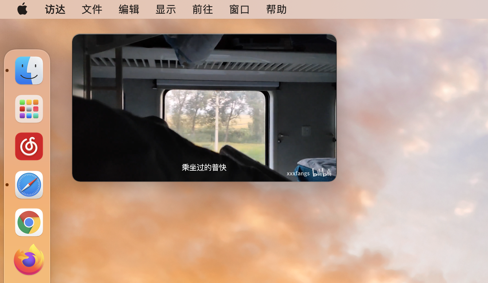

# Macast

在MacOS上接收来自手机的视频投屏，支持主流视频软件和其他任何符合dlna协议的投屏



## 安装

进入发布页面下载即可
下载地址:  [Macast](https://github.com/xfangfang/Macast/releases/latest)


## 使用方法

打开应用后，状态栏会出现一个小电视图标，这时你的mac就可以接收来自同一局域网的投屏了。

`注意：本应用会创建 ~/Library/Application\ Support/Macast 目录用于保存应用的配置信息`


## 开发

### 调试

```shell
pip install -r requirements.txt
python Macast.py
```
`注意：第一次运行时mpv启动较慢需要等待片刻`

### 打包

##### 1. 下载mpv

```shell
wget https://laboratory.stolendata.net/~djinn/mpv_osx/mpv-latest.tar.gz
mkdir -p bin && tar --strip-components 2 -C bin -xzvf mpv-latest.tar.gz mpv.app/Contents/MacOS
```

##### 2. 编译

```shell
pip install py2app
pip install setuptools==44.0.0 # 可选，高版本打包出来的应用在我的电脑上有问题
python setup.py py2app
cp -R bin dist/Macast.app/Contents/Resources/
open dist
```

`注意：打包好之后在dist目录下就能找到编译好的内容了`


## 相关链接

[UPnP™ Device Architecture 1.1](http://upnp.org/specs/arch/UPnP-arch-DeviceArchitecture-v1.1.pdf)

[python-upnp-ssdp-example](https://github.com/ZeWaren/python-upnp-ssdp-example)
